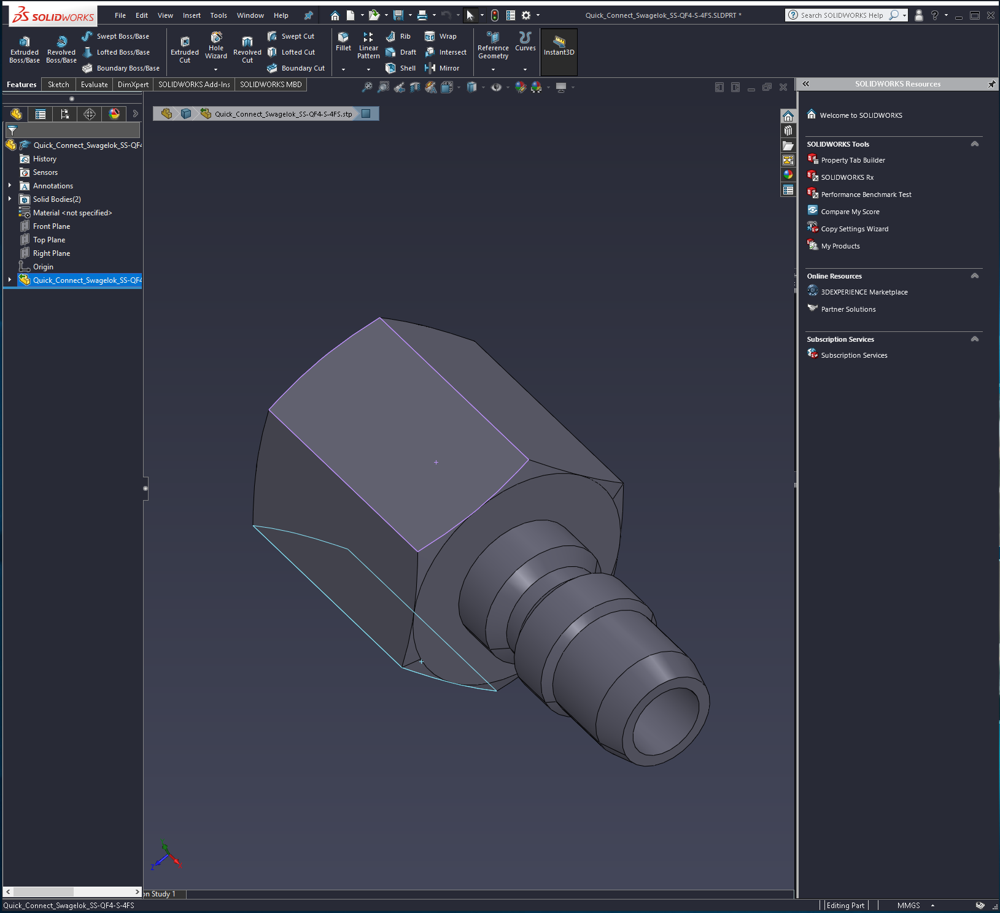

# Dracula for [SolidWorks](https://www.solidworks.com)

> A dark theme for [SolidWorks](https://www.solidworks.com).

## Install

All instructions can be found at [draculatheme.com/solidworks](https://draculatheme.com/solidworks).

## Team

This theme is maintained by the following person(s) and a bunch of [awesome contributors](https://github.com/dracula/solidworks/graphs/contributors).

 |
--- |
[Tim Clifford](https://github.com/tim-clifford) |

## License

[MIT License](./LICENSE)